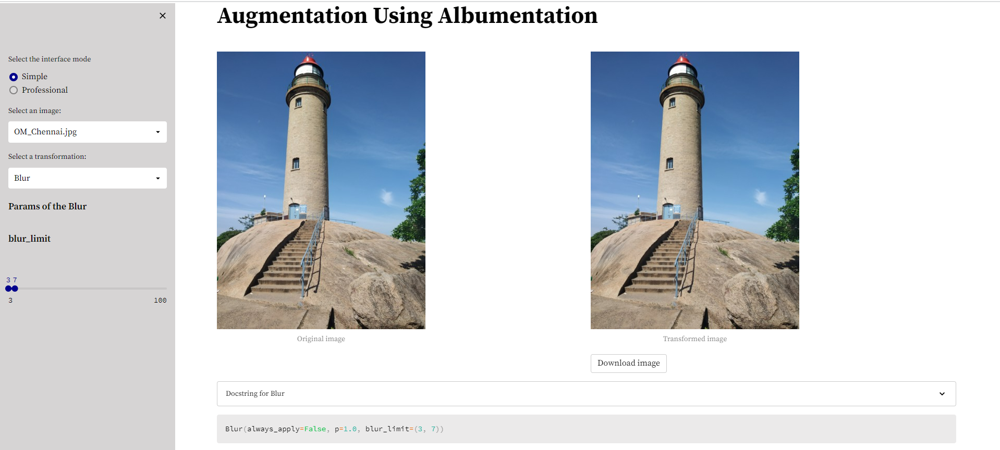
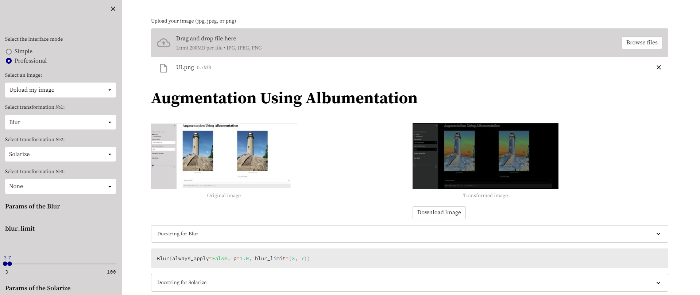

# Data Augmentation
This repository is created for making the data augumentation work more explainable and easy to use in project due to its docker integration and UI.

## Demo app
Link for demo application is provided below
[https://imageaugmentation.herokuapp.com/](https://imageaugmentation.herokuapp.com/)

## How to use this software for development in local?

1. Download [Miniconda](https://docs.conda.io/en/latest/miniconda.html)

2. After Anaconda installation, go to search and run Anaconda Prompt and create virtual environment using following commands

    `conda create -n augmentation python=3.9`

3. Use following command to login to conda environment

    `conda activate augmentation`

4. Clone the git repository

    `git clone https://github.com/ashishkrb7/data-augmentation.git`

5. Go to project directory

    `cd data-augmentation`

6. Install prerequisites using following command

    `python -m pip install -r requirements.txt`

7. Run app in local

    `streamlit run app.py`

    If you want to work with you own images just replace the last line with:

    `streamlit run app.py -- --image_folder PATH_TO_YOUR_IMAGE_FOLDER`

    If your images have some unusual proportions you can use `image_width` parameter to set the width in pixels of the original image to show. The width of the transformed image and heights of both images will be computed automatically. Default value of width is `400`.

    `streamlit run app.py -- --image_width INT_VALUE_OF_WIDTH`

In your terminal you will see the link to the running local service similar to : 
```console
  You can now view your Streamlit app in your browser.

  Network URL: http://YOUR_LOCAL_IP:5000
  External URL: http://YOUR_GLOBAL_IP:5000
```

## Run in docker as a service
You can run the service in docker:

    `docker-compose up --build -d`

It will be available at http://DOCKER_HOST_IP:5000

## Run below command to make own docker image

```
   # Build docker image 
   docker build -t imageaugmentation:v1 .
   # Run docker container 
   docker run -p 5000:5000 -itd --name demo imageaugmentation:v1 
   # Remove the container after usage
   docker rm demo -f
```

## How to use?


The interface is very simple and intuitive:
1. On the left you have a control sidebar. Select the "Simple" mode. You can choose the image and the transformation.
2. After that you will see the control elements for the every parameter this transformation has.
3. Every time you change any parameter you will see the augmented version of the image on the right side of your screen. You can download the image from the download button available below
4. You can also find there the original docstring for this transformation.
5. Below the images you can find a code for calling of the augmentation with selected parameters.


In the professional mode you can do below extra than Simple mode:
1. Upload your own image
2. Combine multiple transformations


## Author

Ashish Kumar

See ['MIT License'](https://github.com/ashishkrb7/data-augmentation/blob/main/LICENSE) for more information.

[](https://www.linkedin.com/in/ashishkrb7/) 
[](mailto:ashish.krb7@gmail.com) 
